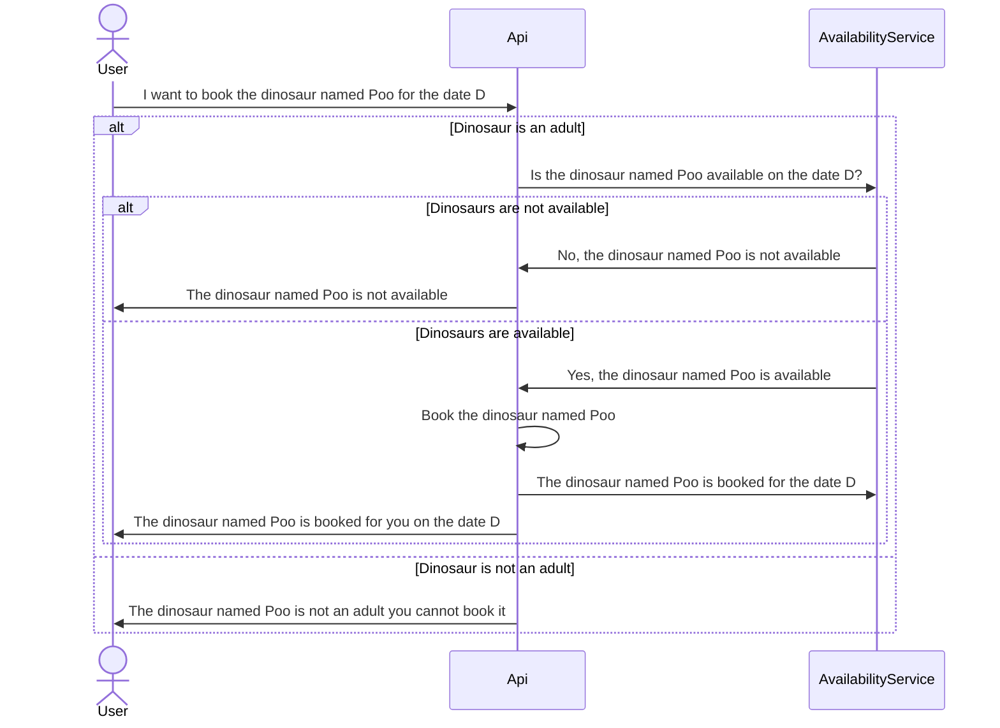

# How to book a dinosaur

```mermaid
sequenceDiagram
    actor User
    participant Api
    participant AvailabilityService
    
    User->>Api: I want to book the dinosaur named Poo for the date D
    alt Dinosaur is an adult
        Api->>AvailabilityService: Is the dinosaur named Poo available on the date D?
        alt Dinosaurs are not available
            AvailabilityService->>Api: No, the dinosaur named Poo is not available
            Api->>User: The dinosaur named Poo is not available
        else Dinosaurs are available
            AvailabilityService->>Api: Yes, the dinosaur named Poo is available
            Api->>Api: Book the dinosaur named Poo
            Api->>AvailabilityService: The dinosaur named Poo is booked for the date D
            Api->>User: The dinosaur named Poo is booked for you on the date D
        end
    else Dinosaur is not an adult
        Api->>User: The dinosaur named Poo is not an adult you cannot book it
    end
```
